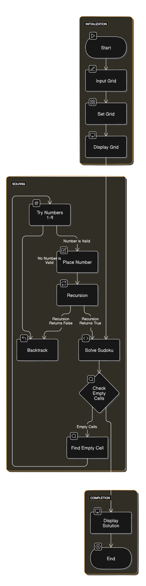

# Sudoku Solver in Java

This is a simple Sudoku solver implemented in Java using a backtracking algorithm.

## How to Use

1. Clone the repository:
   ```sh
   git clone https://github.com/abhijeetkakade1234/Sudoku-Solver.git
2. Compile the Java files:
   ```sh
   javac *.java
   
3. Run the program:
   ```sh
      java Main

4. Enter the initial Sudoku grid when prompted. Use '0' for empty cells.
5. The program will display the solved Sudoku grid if a solution exists.

## Example
#### input:
   
      5 3 0 0 7 0 0 0 0
      6 0 0 1 9 5 0 0 0
      0 9 8 0 0 0 0 6 0
      8 0 0 0 6 0 0 0 3
      4 0 0 8 0 3 0 0 1
      7 0 0 0 2 0 0 0 6
      0 6 0 0 0 0 2 8 0
      0 0 0 4 1 9 0 0 5
      0 0 0 0 8 0 0 7 9
   

#### output:
   
      5 3 4 6 7 8 9 1 2
      6 7 2 1 9 5 3 4 8
      1 9 8 3 4 2 5 6 7
      8 5 9 7 6 1 4 2 3
      4 2 6 8 5 3 7 9 1
      7 1 3 9 2 4 8 5 6
      9 6 1 5 3 7 2 8 4
      2 8 7 4 1 9 6 3 5
      3 4 5 2 8 6 1 7 9
   
### Classes and Methods
- 'SudokuGrid' class:
   - 'setGrid(int[][] grid)': Sets the initial state of the Sudoku grid.
   - 'getGrid()': int[][]: Returns the current state of the Sudoku grid.
   - 'solve()': boolean: Solves the Sudoku puzzle. Returns true if a solution is found, false otherwise.
   - 'isValid(int row, int col, int num)': boolean: Checks if placing 'num' at grid[row][col] is valid.
   - 'solveRecursive(int row, int col)': boolean: Recursive function to solve the Sudoku puzzle.

## Contributing
If you have any questions or suggestions, please feel free to open an issue or pull request on GitHub.

## License
MIT License Copyright (c) 2024 Abhijeet  Kakade


   
## Flowchart

